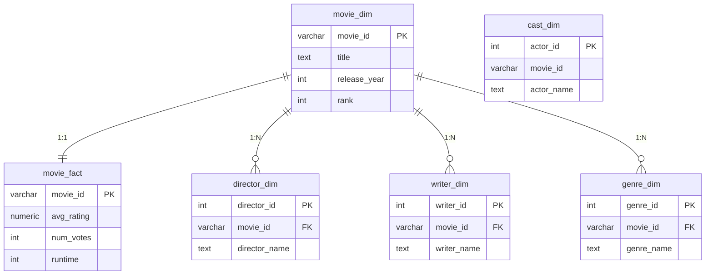

# Movie Data Warehouse — IMDb & Streaming Platforms (Kaggle)

A PostgreSQL project that combines IMDb movie data with catalogs from Disney+, Netflix, and Prime Video (all from Kaggle) into a clean star schema.

## Data Sources

| Dataset | Link |
|---|---|
| IMDb Movies | https://www.kaggle.com/datasets/tiagoadrianunes/imdb-top-5000-movies |
| Disney+ Movies and TV Shows | https://www.kaggle.com/datasets/shivamb/disney-movies-and-tv-shows |
| Netflix Movies and TV Shows | https://www.kaggle.com/datasets/shivamb/netflix-shows |
| Amazon Prime Movies and TV Shows | https://www.kaggle.com/datasets/shivamb/amazon-prime-movies-and-tv-shows |

## Tech Stack

PostgreSQL, pgAdmin, SQL

## Data Model

The IMDb data is modeled as a star schema: `movie_fact` holds the numeric metrics (rating, votes, runtime), and the `_dim` tables hold descriptive attributes. Genres, directors, and writers each get their own dimension table since a movie can have more than one of each.



`cast_dim` is loaded separately from the streaming datasets and has no foreign key to `movie_dim` — it uses a different ID space (see below).

## ETL Process

**Extract:** raw CSVs loaded into staging tables with `\copy`.

**Transform:**
- Split multi-valued columns (`genre`, `director`, `writer`, `cast`) into individual rows with `string_to_array()` + `unnest()`, so each dimension table holds one value per row (1NF).
- Converted `duration` from text (`"23 min"`) to an integer column, and `date_added` from text to a proper `DATE` type.
- Dropped columns not needed for the analysis (`director`, `country`, `rating` from the streaming tables).
- Rebuilt the flat source table as a fact table plus four dimension tables, each with a surrogate key and a foreign key back to `movie_dim`.

**Load:** `INSERT INTO ... SELECT` from staging into the final tables. `TRUNCATE` + re-`INSERT` is used when a transformation needs correcting, so the load step can be re-run safely.

## Challenges

**Duplicate IDs across platforms.** `cast_dim` was first built using each platform's raw `show_id` as `movie_id`. Since Disney+, Netflix, and Prime Video each number their shows independently starting from `s1`, unrelated titles from different platforms ended up sharing the same ID. Fixed by prefixing each ID with its platform (`disney_s1`, `netflix_s1`, etc.).

**`cast` as a column name.** PostgreSQL reserves `CAST` for type conversion, so referencing the `cast` column unquoted caused a parser error. Fixed by quoting it (`"cast"`).

**Mixed units in `duration`.** The column stores minutes for movies but season counts for TV shows, so it needs to be handled per `type` rather than assumed to always mean minutes.

**No shared key between IMDb and streaming data.** The two sides don't share an ID, so joining them means matching on normalized `title` + `release_year` instead.

## Repository Structure

```
sql/
  01_etl_star_schema.sql     -- staging, cleaning, transformation, star schema load
  02_analysis_queries.sql    -- analytical queries
README.md
```

## How to Run

1. Create a PostgreSQL database and load the raw CSVs into staging tables (`movies`, `disney`, `netflix`, `prime`).
2. Run `sql/01_etl_star_schema.sql`.
3. Run `sql/02_analysis_queries.sql` for example queries.

## Next Steps

Analytical queries joining the star schema with streaming availability by title + release year, and basic aggregations (top genres, most prolific directors, platform comparisons).
